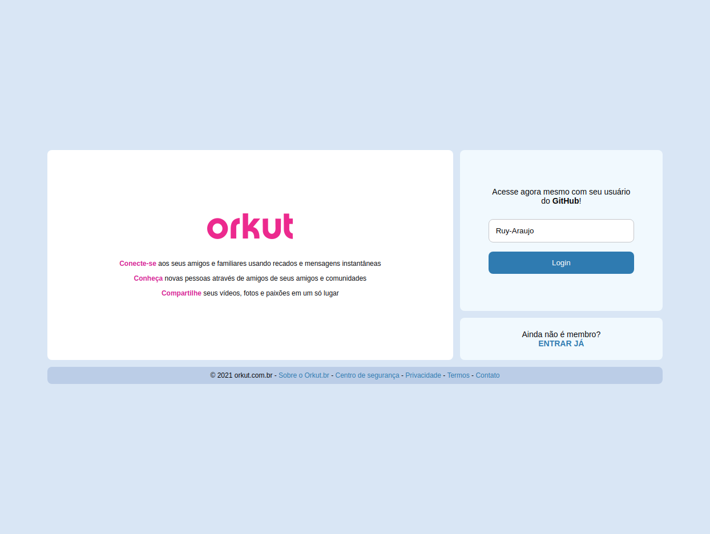

# React Orkut

A orkut front-end clone.


## About

The project consist in recreate orkut front-end, but applying new technologies like React.

This project was taught by the Alura team in front-end challenge week.

Attention: this project created only to apply my studies.

You can see a deploy [here]().

## Features

- [x] Index Page
- [x] Login Page
- [x] Login System
- [] Communites Page
- [] Users Page
- [] Index Menu

## 🚀 Getting Started

These instructions will allow you to obtain a copy of the project for development and testing purposes.

### 📋 Prerequisites

Nodejs 14+.

### 🔧 Install and Run

Clone the project

```sh
git clone react-orkut
```

Install dependencies

```
npm install
```

Run project

```sh
cd react-orkut
npm run dev
```

The application should be up and running at [http://localhost:3000](http://localhost:3000)

## 🛠️ Technologies

- [React](https://reactjs.org/)
- [Nextjs](https://nextjs.org/)
- [DatoCMS](https://www.datocms.com/)
- [Github_API](https://docs.github.com/en/rest)

## 🧑‍🎨 Autor

<a href="https://github.com/Ruy-Araujo">
 
 <p><strong>Ruy Araujo</strong></p>
</a>

[](https://www.linkedin.com/in/ruy-araujo)

## 📷 Screen Shots

#### Index Page


#### Login Page



## 📄 License

This project is under MIT-license - see file [LICENSE.md](https://github.com/usuario/projeto/licenca) for details.


